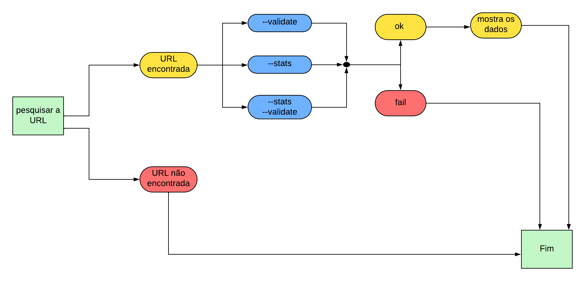
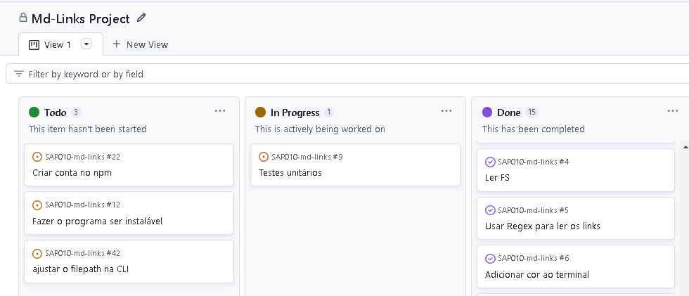

# Markdown Links

   
  Status do projeto: concluído ✔  
 Ferramentas e tecnologias utilizadas:  

  <a href="https://nodejs.org/en">
  
  <a href="https://developer.mozilla.org/en-US/docs/Learn/JavaScript/First_steps/What_is_JavaScript">
  
  <a href="https://jestjs.io/pt-BR/">
  
   <a href="https://git-scm.com/">
  
  <a href="https://github.com/">
  
  <a href="https://code.visualstudio.com/">
  
  
  

---
## Índice

* [1. Prefácio](#1-prefácio)
* [2. Resumo do projeto](#2-resumo-do-projeto)
* [3. Guia de instalação]()
* [4. Guia de uso]()
* [5. Fluxograma](#5-fluxograma)
* [6. Organização do projeto](#6-organização-do-projeto)
* [7. Testes unitários]()
* [8. Desenvolvedora](#8-desenvolvedora)

***

## 1. Prefácio

[Markdown](https://pt.wikipedia.org/wiki/Markdown) é uma linguagem de marcação
muito popular entre os programadores. É usada em muitas plataformas que
manipulam texto (GitHub, fórum, blogs e etc) e é muito comum encontrar arquivos
com este formato em qualquer repositório (começando pelo tradicional
`README.md`).

## 2. Resumo do projeto

Os arquivos `Markdown` normalmente contém _links_ que podem estar
quebrados, ou que já não são válidos, prejudicando muito o valor da informação que está ali. 

Pensando nisso, foi criado o projeto Md-links, com o objetivo de percorrer estes arquivos markdown, retornando as listas de links, textos e caminhos dos respectivos arquivos, além de informar quantos links de extensão .md esses arquivos possuem, se são únicos e se estão quebrados ou não.

## 5. Fluxograma

Foi criado o seguinte fluxograma para auxiliar no desenvolvimento do projeto:

## 6. Organização do Projeto

A ferramenta utilizada para organização do projeto foi o Github Projects:

## 8. Desenvolvedora
Geane Ramos 

 

